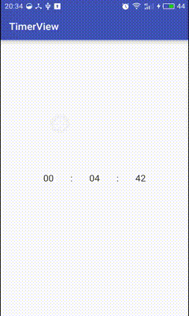
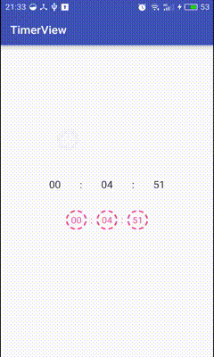
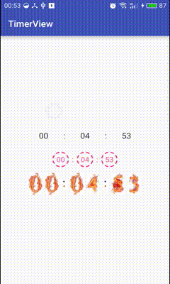
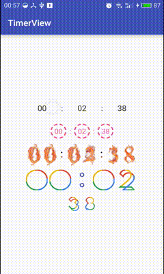
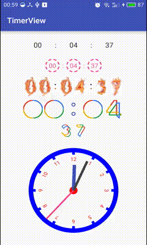

# 解耦解的早，改需求没烦恼
>世上本没有解耦，需求改的多了也便有了解耦。 —— 产品经理

本例将通过一个计时控件，聊聊如何解耦~

本`TimerView`仅作为`demo`，不保证其健壮性，请勿在实际项目中使用。

# 特点
- `UI容器`与`计时逻辑`分离
- `UI容器`与`具体UI布局`分离

# Let's Go
话说，小明在做一个电商项目，有个倒计时需求。

## 需求1.0
要求"时、分、秒"数字显示。

这个简单，小明很快自定义了一个`TimerView`:
```java
public class TimerView {
    TextView tvHour, tvMinute, tvSecond;
    TextView divider1, divider2;
    ...
}
```



## 需求2.0
界面太丑啦，加点颜色和背景吧~

这个也简单，小明很快加了一些自定义属性：
```java
public class TimerView {
    TextView tvHour, tvMinute, tvSecond;
    TextView divider1, divider2;
    
    // 添加 自定义属性
    int tvHourBgRes, tvMinuteBgRes, tvSecondBgRes;
    int tvHourColor, tvMinuteColor, tvSecondColor;
    ...
}
```


## 需求3.0
这时，产品经理又跑了过来，你看我发现了啥~

发现一套火焰数字.jpg，好炫酷的说，帮忙改上去吧~



小明内心：你TM有病啊！！！

你发现了么，这下小明把自己带到沟里了。新需求要求显示`火焰数字图片`(ImageView)。<br/>
然而，由于`TimerView`由`TextView`构成，再怎么自定义属性也实现不了新需求(ImageView)了。<br/>
说的就是你呀：https://github.com/iwgang/CountdownView

### 分析
为啥会这样呢？因为一开始就设计紧耦合了。<br/>
`TimerView`依赖了具体子类`TextView`，功能也就被局限在`TextView`了。<br/>
那我们只需这么调整一下，把`TextView`改成更抽象的`View`。<br/>
这样一来`tvHour`既可以是`TextView`，也可以是`ImageView`，或者某个`ViewGroup`，功能得以拓展：

```java
public class TimerView {
    //TextView tvHour, tvMinute, tvSecond;
    View tvHour, tvMinute, tvSecond;
    //TextView divider1, divider2;
    View divider1, divider2;
    
    // 自定义属性也不用了，因为无法确定 tvHour 这些究竟是啥子类。
    //int tvHourBgRes, tvMinuteBgRes, tvSecondBgRes;
    //int tvHourColor, tvMinuteColor, tvSecondColor;
    ...
}
```

这也体现了软件设计的一大原则：**要依赖抽象(View)而不要依赖具体(TextView)。**

### 依赖注入
还有一个问题：`tvHour`究竟是啥呢，这个得由用户决定。<br/>
通常我们会提供一系列`setXXX()`方法给用户进行设置。这个套路叫做**依赖注入**。<br/>
依赖注入是解耦的一种常见的方式。通常，当你有无法确定的一些东西，都应该抛给用户决定。<br/>
举个例子，`View`被点击时，设计者不知道你想干嘛，于是设计了`View.setOnClickListener()`。这是典型的依赖注入。

好了，`ImageView`可以支持了，然而对于界面更新`ImageView`和`TextView`肯定是不一样的。<br/>
该怎么更新又无法确定了，我们可以再次用`依赖注入`的方式解耦，把难题抛给用户。<br/>
因此，我设计了类似`Adapter`的东西，都在代码里，就不详细展开了。

## 需求4.0
嗨呀~还不够啊，产品经理的脑洞总是很大的。

产品经理：我看到一个 svg 诶~

小明：算我倒霉。不过，我早就重构解耦过了。改需求, 小case~



## 需求5.0
产品经理：小明，你还活着那？我发现机械表更好看诶~

小明: ******, 我改就是了



# 感谢
https://github.com/lypeer/GoogleClock

https://github.com/gnehsuy/ClockView
